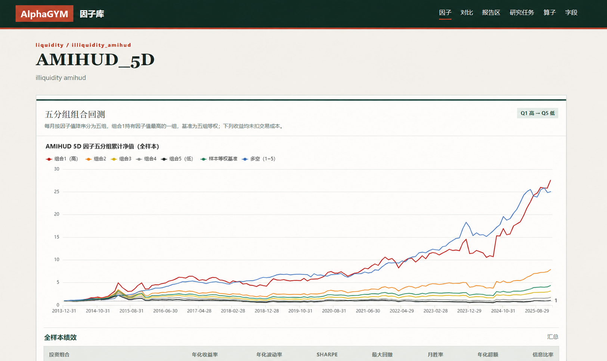
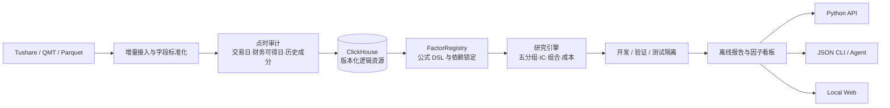

# AlphaGYM — Quant Research Toolbox

[](https://github.com/Lawrenceeeeeeee/alphagym/actions/workflows/ci.yml)


[](LICENSE)

可扩展的多市场、多资产量化研究工具箱。AlphaGYM 将数据接入、因子定义、回测、
开发／验证／测试隔离和离线报告组织成可复现的 Python、CLI 与 Web 工作流。
中国 A 股是当前首个完整落地的研究市场，不是产品的长期边界。



> 上图由真实 A 股历史数据生成，用于展示研究系统的因子分层与报告能力；区间为
> 2014–2025，曲线未扣交易成本，不构成投资建议或未来收益承诺。仓库不包含原始行情、
> 个股信号、持仓或账户信息。

## 项目解决什么问题

传统因子脚本容易把数据读取、公式、回测和报告混在一起，也很难证明历史结果没有使用
未来信息。AlphaGYM 把研究过程拆成带版本的数据与计算契约：信号在月末收盘后形成，下一
交易日开盘成交；财务字段按可得日使用；模型选择只发生在开发与验证期，测试期只评估。

## 我的实现范围

- 设计并实现因子注册表、受限公式 DSL、依赖锁定、稳定版本与缓存复用。
- 将行情、基本面、缓存、运行目录和报告统一迁移到 ClickHouse，支持增量 Tushare、QMT
  和 Parquet/CSV 导入，以及可恢复迁移和 NAS 备份。
- 实现五分组回测、IC/ICIR、交易成本、阶段隔离、组合比较和静态报告流水线。
- 提供 Python API、稳定 JSON CLI、本地 Web 看板、Docker 环境与合成数据 CI。

## 系统架构



## 技术难点

- **点时一致性：** 后复权因子独立保存，财务使用公告可得日，未来数据不能改写历史信号。
- **统一持久化：** 大规模表格和小型报告资源共享 ClickHouse 的原子发布、版本读取与迁移检查点。
- **研究隔离：** 因子方向、去相关筛选和组合权重在验证期末冻结，测试期和 2026 监控期不参与调参。
- **可复现入口：** Web 和 CLI 只读取离线成品；相同定义使用稳定 hypothesis_id 和数据版本。

本仓库包含代码、配置、使用说明和一张汇总研究截图。**原始数据、完整研究报告、模型产物
与交易信号均不发布。** 见 [发布边界](docs/privacy.md)。

## 使用方法

**完整教程：[从零开始使用 AlphaGYM](docs/getting-started.md)。**

使用顺序：**安装 Python 3.12 → 获取代码 → 建立环境 → 启动 ClickHouse → 合成数据体验 → 配置数据根
→ 准备真实数据 → 回测和生成报告 → 阅读结果**。

### 1. 安装（在包含 pyproject.toml 的项目目录执行）

先安装 Python 3.12 并获取代码，详细操作及下载入口见教程第 1 节。
Windows / PowerShell：

```powershell
py -3.12 -m venv .venv
.\.venv\Scripts\Activate.ps1
python -m pip install .
```

Mac / Linux：

```bash
python3.12 -m venv .venv
source .venv/bin/activate
python -m pip install .
```

若 PowerShell 禁止激活脚本，可直接用 `.\.venv\Scripts\python.exe` 替代后续命令的
`python`，不必修改系统策略。新开终端需要重新激活环境。

### 2. 不需要行情和账号的首次体验

先按 [ClickHouse 部署与迁移](docs/clickhouse.md) 启动数据库并设置连接环境变量。
所有行情、财务、缓存和报告统一保存在 ClickHouse，Parquet 只用于显式导入导出。

```shell
python -m alphagym --help
python -m alphagym factor list --json
python scripts/run_library_smoke.py --background
```

最后一条自动使用合成数据完成因子回测、后台报告和产物检查。预期输出 `"ok": true`；
输出的 `path` 是数据库资源的逻辑位置。使用 `report export --root <该路径的工作区根>
--report-id <输出ID> --output <导出目录>` 导出后打开 HTML，即可查看带 SMOKE 水印的报告。
它仅验证软件流程，不是真实投资研究。

### 3. 开始自己的研究

根据教程配置独立的 `ALPHAGYM_DATA_ROOT`，然后依次执行初始化、数据准备和报告流程。
**安装软件不附带真实数据；QMT 导入也只生成日线与复权因子。** 不同研究所需的财务、
行业和指数历史资料不同，不能直接跳过数据准备。

|你要做的事|阅读位置|
|---|---|
|配置 ClickHouse、同步 Tushare、导入 Parquet、备份到 NAS|[数据库指南](docs/clickhouse.md)|
|从零安装 Python、环境、依赖|[新手教程](docs/getting-started.md)第 1～2 节|
|先体验完整报告|第 3 节：合成数据体验|
|配置数据根，导入 QMT/其他数据|第 4～5 节：目录、输入字段和按需校验|
|运行自己的首次研究，读取报告|第 6～7 节：spec、回测、后台任务及 Web|
|使用 Python 或让 Agent 调用|第 8 节，以及 [Python API](docs/python-api.md)|
|下次启动、更新或排查错误|第 9 节|
|迁移到 Mac，包括数据和历史路径|第 10 节|

### 可选功能

仅支持 Python 3.12。可选 Tushare 导入工具使用 `python -m pip install ".[data]"`。
Web 使用 `.[web]`，sklearn 模型使用 `.[ml]`，XGBoost/LightGBM 使用 `.[boosting]`；
完整开发环境使用 `pip install -e ".[dev]"`。基础安装无需这些额外依赖。
通过 `--root` 或 shell 环境变量 `ALPHAGYM_DATA_ROOT` 指定本地数据根；`.env.example`
仅为模板，普通 CLI 不自动加载 `.env`。不要把令牌、数据湖或报告放进 Git。

## Python 与 Agent 入口

```python
from pathlib import Path
from alphagym import Workspace

workspace = Workspace(Path("/path/to/local/data"))
print(workspace.status())        # 只读，不隐式创建数据库
workspace.initialize()          # 显式初始化与内置因子登记
factors = workspace.list_factors()
# 准备好本地点时数据和报告 spec 后：
# task = workspace.create_report(Path("/path/to/report.yaml"), ensure_runs=True)
# workspace.start_report(task["report_id"])
# result = workspace.wait_report(task["report_id"])
```

```shell
alphagym workflow list --json
alphagym workflow describe ml-exploration --json
alphagym report create --root /path/to/local/data --spec /path/to/report.yaml --ensure-runs --run --json
alphagym report wait --root /path/to/local/data --report-id <returned-id> --json
```

这里的路径和 ID 需要替换；这些研究命令假设你已按教程初始化数据根并准备好输入。
`--ensure-runs` 先同步补跑缺少的因子回测，`--run` 随后启动后台报告；查询和读取报告不会重算。Python API 返回对象或
产物路径，CLI 返回 JSON，领域错误退出码为 1，用法错误为 2。
完整接口见 [Python API](docs/python-api.md)；兼容变更与分层见 [架构说明](docs/architecture.md)。
报告配置可从 [公开示例](config/report.example.yaml) 开始，因子回看期会写入生成的 manifest。

## 功能与研究纪律

- 169 个注册因子及受限公式 DSL，支持版本、依赖与缓存。
- 独立的 [高频探索模块](docs/high-frequency.md)：162 个订单簿因子、秒级时间隔离与成本情景；
  Web「高频探索」只读离线报告，当前适配 OKX BTC-USDT 现货。
- 不复权行情与独立累计后复权因子分开存储；财务按公告可得日处理。
- 月度正式报告与独立的日／周／月频探索；后者不能冒充实盘成交结果。
- 模型开发、验证、测试与监控分开，训练需要检查收益标签的结束时间。
- 行业分层/中性化要求真实点时行业及历史基准资料。代码能力不代表本地数据已合格；
  运行前必须审计，不得用快照、历史回填或未知分类替代正式输入。
- QMT 为可选模拟盘模板，默认不绑定报告，默认不下单。见 [QMT 说明](qmt/README.md)。

## 目录

|目录|内容|
|---|---|
|`src/alphagym/`|数据契约、因子、模型、报告、CLI 与本地 Web|
|`config/`|研究方法配置与示例，不包含实跑结果|
|`scripts/`|本地导入、审计、研究与静态报告工具|
|`tests/`|合成数据上的回归测试|
|`qmt/`|安全默认的模拟盘执行模板|
|`docs/`|使用、验证和发布边界|

`research/` 为本地私有笔记，`legacy/` 为本地历史工程档案，两者都不随发布上传。
数据和离线产物应放在独立数据根下。

## 验证

开发者先安装 `.[dev]`，再在项目目录执行：

```shell
python -m ruff check src tests scripts
python -m pytest -q
python scripts/run_equity_smoke.py --output /path/to/local/smoke
python scripts/run_library_smoke.py --background
```

更多命令见 [研究工作流](docs/workflows.md)。当前研究结论不收录在此 README。
